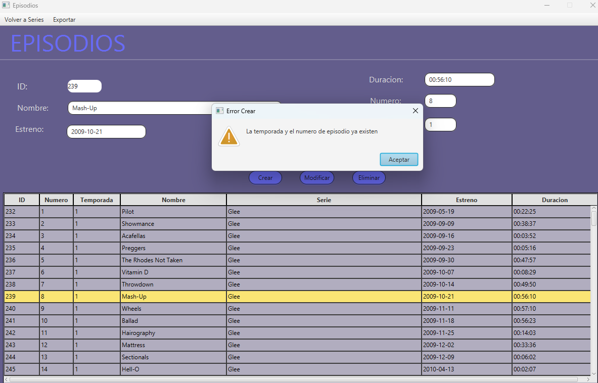

# Proyecto de Aplicación de Series de TV

Autores: **Víctor Sánchez Nogueira** y **Joel Figueirido Molares**

## 1. Introducción

### 1.1 Descripción del Proyecto

Este proyecto tiene como objetivo desarrollar una aplicación para gestionar y consultar información sobre series de
televisión. La aplicación permite a los usuarios buscar entre una lista de series,filtrar según alguno de sus campos (
idioma,estado y cadena), y a su vez filtrar entre diversos a la vez.Ademas los usuarios pueden ver los episodios de una
serie seleccionada así como crear uno nuevo o modificar uno existente,tambien se pueden exportar episodios a un archivo
json.

#### Funcionalidades principales:

- **Ordenacion de series**: Los usuarios pueden seleccionar el orden segun el cual quieren ordenar las
  series,calificacion y fecha de estreno,ambas ascendente y descendente.
- **Visualización de episodios**: Permite a los usuarios consultar los episodios de la serie seleccionada, con detalles
  como estreno,título,temporada y numero de episodio.
- **Creación de episodios**: Los usuarios pueden crear un nuevo episodio y añadirlo a la lista de episodios de la serie.
- **Modificación de episodios**: Los usuarios pueden editar los detalles de un episodio existente, como el título, la
  temporada y el número de episodio.
- **Eliminación de episodios**: Los usuarios pueden eliminar un episodio de la lista de episodios de la serie.
- **Exportación de episodios**: Los usuarios pueden exportar la lista de episodios de una serie a un archivo JSON.

### 1.2 Descripción de la Base de Datos

La aplicación obtiene los datos desde dos bases de datos diferentes:

- **Base de datos Login**: Almacena las credenciales encriptadas de los usuarios para el inicio de sesión.

- **Base de datos app_series**: Almacena la información de las series de televisión, y sus episodios.

- En general trabajamos con 3 tablas,la tabla series,la tabla episodios y la tabla usuarios.

### 1.4 Tecnologías utilizadas

Este proyecto ha sido desarrollado con las siguientes tecnologías:

- **Java**: Lenguaje de programación principal utilizado.
- **JavaFX**: Para la creación de la interfaz gráfica de usuario (GUI).
- **FXML**: Lenguaje utilizado para diseñar las vistas de la aplicación.
- **Maven**: Utilizado para la gestión de dependencias y la construcción del proyecto.
- **MySQL**: Base de datos utilizada para almacenar la información de las series y los episodios y las credenciales de
  los usuarios.

## 2. Estructura del Proyecto

El proyecto sigue el patrón de arquitectura **MVC (Modelo-Vista-Controlador)**. Cada una de estas capas tiene una
responsabilidad clara:

- **Modelo**: Esta capa gestiona la lógica del negocio. Aquí se define la estructura de los datos (series, episodios,
  usuarios) y las interacciones con la Base de Datos.
- **Vista**: Los archivos **FXML** definen la interfaz gráfica. Esta capa gestiona lo que el usuario ve y con lo que
  interactúa.
- **Controlador**: Gestiona la interacción entre el modelo y la vista. Los controladores son responsables de manejar
  eventos de usuario (como el CRUD) y procesar los datos obtenidos desde el modelo.

## <u>Estructura del código</u>

## 2.1 Descripción de las clases en el paquete `controlador`

1. **`Controlador`**: Esta clase funciona como una base para los controladores y proporciona un metodo comun, la
   visualización de mensajes en la interfaz gráfica
    - Método clave:
        - **`showWarning`**: Muestra un mensaje de advertencia en la interfaz gráfica.
        - **`showMessage`**: Muestra un mensaje de información en la interfaz gráfica como que se creó correctamente un episodio .
2. **`EpisodiosController`**: Controlador para la vista de episodios. Se encarga de mostrar la lista de episodios de una
   serie y gestionar las operaciones CRUD.
    - Métodos clave:
        - **`initialize`**: Configura el estado inicial del controlador al cargar la interfaz gráfica.
        - **`cargarTabla`**: Llena la tabla de episodios con los datos de la base de datos.
        - **`crearEp`**: Crea un nuevo episodio en la base de datos.
        - **`modificarEp`**: Modifica los datos de un episodio existente.
        - **`eliminarEp`**: Elimina un episodio seleccionado de la base de datos.
        - **`toJSON`**: Exporta la lista de episodios a un archivo JSON.
        - **`prepareExportDirectory`**: Verifica y crea el directorio donde se guardará el archivo JSON.
3. **`LoginController`**: Controlador para la vista de inicio de sesión. Gestiona el proceso de inicio de sesión y la
   creación de nuevos usuarios.
    - **`registrarUser`**: Crea un nuevo usuario y almacena sus credenciales en la base de datos.
    - **`acceder`**: Verifica las credenciales del usuario y permite el acceso a la aplicación.
    - **`toSerie`**: Cambia a la vista de series tras un inicio de sesión exitoso.
4. **`SerieController`**: Controlador para la vista de series. Se encarga de mostrar la lista de series y gestionar las
   operaciones de búsqueda y filtrado.
    - **`initialize`**: Configura el estado inicial del controlador al cargar la interfaz gráfica.
    - **`cargarTabla`**: Llena la tabla de series con los datos de la base de datos.
    - **`buscar`**: Realiza una búsqueda de series según el nombre introducido por el usuario.
    - **`filtrar`**: Filtra las series según el idioma, estado y cadena seleccionados por el usuario.
    - **`ordenar`**: Ordena las series según la calificación y la fecha de estreno, de forma ascendente o descendente.
    - **`toEpisodios`**: Cambia a la vista de episodios de la serie seleccionada.
    - **`toCast`**: Cambia a la vista de reparto de la serie seleccionada.

## 2.2 Relación entre las clases


Las clases del paquete `controlador` están relacionadas de la siguiente manera:

- **`LoginController`**: Gestiona el inicio de sesión y la creación de nuevos usuarios. Tras un inicio de sesión exitoso, redirige a la vista de series mediante el método `toSerie`.

- **`SerieController`**: Gestiona la visualización y filtrado de series. Permite cambiar a la vista de episodios de una serie seleccionada mediante el método `toEpisodios`.

- **`EpisodiosController`**: Gestiona la visualización y operaciones CRUD de los episodios de una serie. Se inicializa con la serie seleccionada desde `SerieController`.

- **`Controlador`**: Clase base que proporciona métodos comunes para los controladores, como `showWarning` para mostrar mensajes de advertencia en la interfaz gráfica.


## 2.3 Descripción del paquete `modelo`

El paquete `modelo` se encarga de gestionar la lógica de negocio relacionada con las series y episodios. Aquí se definen las clases que modelan los datos que se obtienen de la base de datos.
A su vez se realizan las consultas necesarias para obtener los datos de la base de datos y poder realizar el CRUD.
Tambien aquí manejamos la encriptacion de las contraseñas mediante el algoritmo LZ78.

## 2.4 `src/main/resources` – Almacenamiento de FXML y CSS

La carpeta `src/main/resources` contiene todos los archivos necesarios para la interfaz gráfica de usuario y otros
recursos estáticos.

### Subcarpetas clave y archivos:

1. **`resources/edu/badpals/vista/`**: Esta subcarpeta contiene los archivos **FXML**, los cuales definen la
   estructura y diseño de la interfaz gráfica de la aplicación.

    - **Archivos FXML principales**:
        - **`login.fxml`**: Vista de inicio de sesión.
        - **`serie.fxml`**: Vista de series.
        - **`episodios.fxml`**: Vista de episodios.

# <u>Manual para Desarrolladores</u>

## Requisitos del Sistema

### Antes de comenzar, asegúrate de que tienes instalados los siguientes componentes en tu sistema:

1. JDK 21: Necesario para compilar y ejecutar aplicaciones Java.
2. JavaFX 17: Usado para la interfaz gráfica de usuario (GUI) en Java.
3. Maven: Herramienta para la gestión de proyectos y dependencias en Java.
4. Git: Sistema de control de versiones para gestionar el código fuente.
5. MySQL: Base de datos utilizada para almacenar la información de las series y los episodios y las credenciales de los
   usuarios.

## Instrucciones de Instalación

### 1. Sitúate donde quieras crear la app:

```bash
cd C:\Users\nombredeusuario\Escritorio
```

### 2. Crea un directorio donde almacenar la app:

```bash
  mkdir Directorio
```

### 3.Sitúate en el directorio:

```bash
  cd Directorio
```

### 4.Instala los requisitos:

#### Instalar JDK 21:

- Si no tienes JDK instalado, descárgalo e instálalo desde Oracle JDK 21.
- Durante la instalación, asegúrate de seleccionar la opción de añadir Java al PATH para que puedas usarlo desde la
  línea de comandos.

- Verifica la instalación de Java ejecutando el siguiente comando en la terminal:

```bash
java -version

```

#### Instalar JavaFX 17:

- Descarga JavaFX 17 desde [Gluon](https://gluonhq.com/products/javafx/).
- Descomprime el archivo descargado en un directorio de tu elección.
- Debes configurar las variables de entorno para JavaFX. En Windows, añade la ruta del directorio lib de JavaFX a la
  variable de entorno PATH.
- Para verificar, puedes ejecutar el siguiente comando, reemplazando ruta_a_javafx por la ruta de la carpeta lib:

```bash
set PATH=%PATH%;ruta_a_javafx\lib
```

#### Instalar Maven:

- Si no tienes Maven instalado, descárgalo e instálalo desde [Apache Maven](https://maven.apache.org/download.cgi).
- Descomprime el archivo descargado en un directorio de tu elección.
- Añaade la ruta de la carpeta bin de Maven a la variable de entorno PATH.
- Para verificar la instalación, ejecuta el siguiente comando en la terminal:

```bash
mvn -version
```

#### Instalar Git:

- Si no tienes Git instalado, descárgalo e instálalo desde [Git](https://git-scm.com/downloads).
- Durante la instalación, asegúrate de seleccionar la opción de añadir Git al PATH para que puedas usarlo desde la línea
  de comandos.
- Verifica la instalación de Git ejecutando el siguiente comando en la terminal:

```bash
git --version
```

### 5. Clona el repositorio de la aplicación:

```bash
   git clone https://github.com/joeelfgrd/Series-Api.git
```

### 6. Sitúate en el directorio del proyecto:

```bash
    cd Series-Api
```

### 7. Instala las dependencias del proyecto:

```bash
    mvn install
```

### 8. Ejecuta la aplicación:

#### Para Crear el JAR

```bash
    mvn clean package
```

#### Para ejecutar con el JAR
-Ejecuta el siguiente comando en la terminal pero sustituyendo la ruta del javafx por la tuya:

```bash
    
 java --module-path C:\javafx-sdk-17.0.13\lib --add-modules javafx.controls,javafx.fxml -jar .\target\controlador-1.0-SNAPSHOT.jar
```

## Notas:

- Si solo vas a usar el programa sin necesidad de realizar cambios en el código, asegúrate de tener JDK 21, JavaFX 17 y
  el archivo JAR ejecutable en la carpeta del proyecto.
- Git es opcional; puedes descargar el ZIP del repositorio y extraerlo sin necesidad de clonar.

# <u>Manual de Usuario</u>

## Inicio de Sesión

1. Al abrir la aplicación, se mostrará la pantalla de inicio de sesión.

2. Introduce tus credenciales (usuario y contraseña) y haz clic en **Acceder**.
- Si intentas acceder con credenciales incorrectas, se mostrará un mensaje de error.
- Si no tienes una cuenta, puedes registrarte haciendo clic en **Registrarse**.
  
- 
- Cuando creas una contraseña e usuario,antes de guardarse en la base de datos, esta se cifrará y almacenará para proteger tu información.
  
- 

3. Si accedes con éxito, se mostrará la pantalla principal de la aplicación.
   
4. 
4. Desde aqui puedes ver la lista de las series disponibles.
   
5. 
   5. Puedes filtrar en base a idioma,estado y cadena,tambien puedes filtrar por varios a la vez.Tan solo tienes que poner por lo que quieres filtrar y seleccionar el checkbox.
   
   
6. Puedes ordenar las series en base a calificacion y fecha de estreno, tanto de forma ascendente como descendente.
   
7. Al clicar en una serie,se mostraran los episodios de la misma cuando le demos al boton,en caso de no tener clicada ninguna serie salta un mensaje de error.
   
   
8. Puedes seleccionar un episodio y modificarlo.
   
   
9. Puedes seleccionar un episodio y eliminarlo.
   
10. Puedes exportar los episodios de una serie a un archivo JSON.
    
    
11. También permite crear un nuevo episodio.
 - Aquí vemos como se crearon los episodios en diferentes temporadas con los datos indicados
    
 - Si algún campo ya está repetido en la base de datos,capturamos el error.
    
12. Es posible navegar entre las vistas de series,episodios y reparto utilizando los botones del menuBar.
    
    
    

# Tiempo dedicado

- **Víctor Sánchez Nogueira**:Horas aproximadas: 27h
- Tareas:
- Tareas CRUD
- Creación de la base de datos
- Corrección de errores en CRUD
- Manejo de excepciones
- Arreglos en la interfaz gráfica
- Generado el jar
    

- **Joel Figueirido Molares**:Horas aproximadas: 20h
- Creación de la base de datos
- Corrección de errores en CRUD
- Creación de la interfaz gráfica
- Documentación
- Añadir login
# Extras Realizados

1. **Ordenación de resultados** Ordenación de resultados de las consultas y almacenaje de los datos (se introducirá un menú que consultará al usuario el criterio de ordenación).

- Se permite ordenar las series en función de su calificación y fecha de estreno,de forma ascendente o descendente.
- El seleccionado se realiza desde un menu desplegable que se muestra al usuario en el menuBar,en el que se puede seleccionar la ordenacion deseada.

2. **Control de errores** (errores de ficheros, consultas sin resultados...).

- Se manejan excepciones para evitar fallos en la aplicación.
- Si el usuario introduce credenciales incorrectas, se muestra un mensaje de error.
- Si el usuario borra el paquete data,este se genera automáticamente.
- Si el usuario borra todos los usuarios,se puede crear uno nuevo sin problemas.

3. **Adición de un login** (control de acceso restringido) con usuario y contraseña. Se realizará a través de una BBDD distinta, que almacene la información de los usuarios. Se incorporan las premisas mínimas de seguridad para el acceso.
- Se añade un sistema de inicio de sesión con credenciales almacenadas en una base de datos aparte de la de series llamada Login.
- Los usuarios deben autenticarse para acceder a la aplicación.
- Si el usuario no tiene una cuenta, puede registrarse y crear un nuevo usuario.

# Propuestas de Mejora
- **Posibilidad de crear nuevas series** no lo tuvimos en cuenta porque consideramos demasiado pesado para el usuario tener que crear la serie con todos los episodios,pero en una posible mejora lo consideramos importante.
- **Mejora de la interfaz gráfica** para hacerla mas intuitiva,tal vez cambiar el tipo de filtrado por unos combobox en los que aparezcan las opciones de filtrado.
- **Añadir más funcionalidades** desde poder buscar una serie por su nombre como la posibilidad de marcar series como favoritas, ver recomendaciones
  personalizadas, etc.
- **Añadir un sistema de seguimiento** En el que los usuarios podrían decir que series han visto y cuales no,ademas de poder marcar episodios como vistos.
- **Modificar el código para que se ajuste a más dispositivos** en mi caso tuve que redimensionar la ventana para que se viera bien en mi portatil ya que tenia una pantalla mas pequeña que la de clase.
- **Implementar un sistema de valoración** para que los usuarios puedan calificar las series y dejar comentarios que otra gente pueda ver y comentar.De esta forma podríamos crear un sistema de valoración nuevo en función de los gustos de la gente,tal vez poniendo las típicas estrellitas de valoración.
- **Incluir un sistema de recomendaciones** para sugerir series similares a las que le gustan al usuario.
- **Añadir la funcionalidad de poder ver los episodios** Tal vez redirigiendo a una plataforma externa.

# Conclusiones

- En este proyecto,hemos mejorado nuestra habilidad manejando javafx,como ya sabíamos más o menos como funcionaba,en este proyecto hemos tratado más la parte visual de la aplicación,ya que la parte funcional nos resultó mas facil que en el anterior,tratando de hacerla agradable para el usuario,cabe destacar la intervencion de juan carlos el profesor de la interfaces al que acudimos a preguntar sobre la gestion de colores elegida.
- También nos sirvió para practicar las consultas sql a la base de datos,ya que realizamos todo el CRUD.
- Lo del jar sigue dando un poco de pereza hacerlo pero está bien para no olvidarse de como se hace.
- En general estamos contentos con el resultado final de la aplicación,creemos que hemos mejorado mucho con respecto a la anterior y que la nota que esperamos es de al menos un 8.